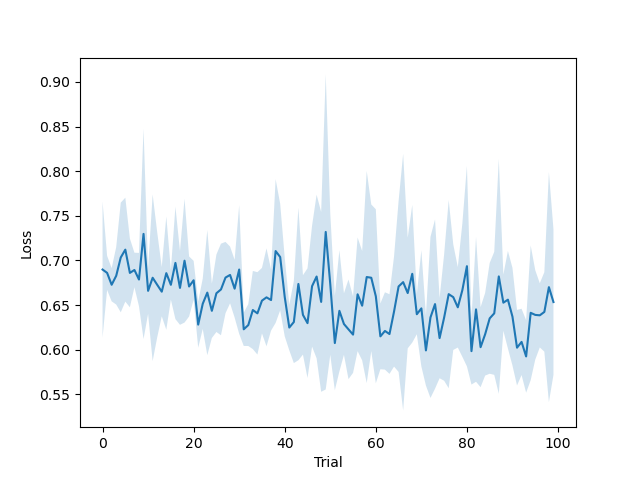
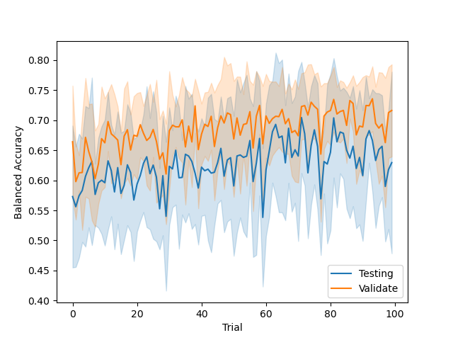
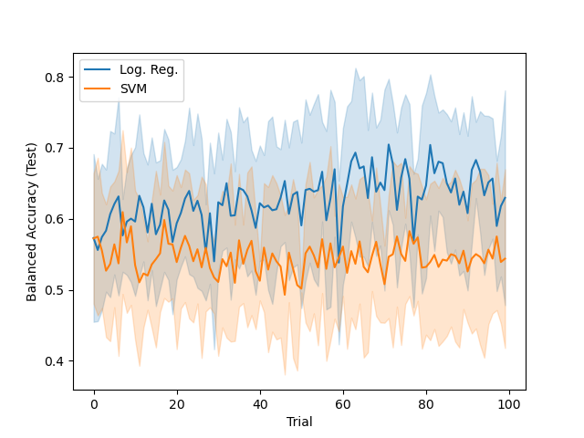

Results at Last!
================

Assuming you now have a data, model, and study configuration file, running MOOP is as simple as running the following command:

.. code-block:: bash

    python run_ml_analysis.py -d data_config.json -m model_config.json -s study_config.json

MOOP will handle the rest, outputting and saving the results to the SQLite database you specified in the study config.

.. note::

    By default MOOP will not overwrite existing results placed in the same output file; this is to prevent accidentally deleting the results of any analyses you ran prior which you might have want to keep. To get around this, you can either move the results file to a new location (allowing MOOP to generate a new results file with the newer analyses results in its place), or add the `--overwrite` flag to prior command. The latter will delete the prior results as MOOP initiates, however, so be careful!

Parsing your Results
--------------------

Pulling Results from the Database
^^^^^^^^^^^^^^^^^^^^^^^^^^^^^^^^^

Once MOOP has completed its study, you should now have a SQLite database file placed in the location you requested in the study configuration file. Naturally, the first step to interpreting the results is to load them; we'll use Pandas for this. Assuming you have not changed your directory after you finished the MOOP run, the following should load the results of each MOOP run into a Pandas DataFrame, with one row per study:

.. code-block:: python

    from sqlite3 import connect
    import pandas as pd

    db_con = connect("output/moop_results.db")
    moop_runs = pd.read_sql(
        "SELECT * FROM sqlite_master",
        con=con
    ).loc[:, 'name']

We now have a list of all MOOP analyses contained within the database. If you ran MOOP using the configuration files we built prior, one of the entries should be
``tutorial_study__tutorial_logreg__walkthrough_data``; the three labels we defined joined with '``__``'. To load the results of that specific run, another SQLite call is needed:

.. code-block:: python

    tutorial_df = pd.read_sql(
        f"SELECT * FROM 'tutorial_study__tutorial_logreg__walkthrough_data'",
        con=con
    )

``tutorial_df`` will now contain measurements MOOP took through its analysis. It will look something like this:

.. csv-table:: Results
    :file: results.csv
    :widths: 30, 30, 30, 30, 30, 30
    :header-rows: 1

Inspecting the Data
^^^^^^^^^^^^^^^^^^^

The results dataframe are split into 3 sections:

* The study index, containing the study replicate and Optuna trial indices.
* The objective value of the model at this point in hyperparameter tuning. By default, Optuna optimizes for a lower value; as such, if this tool is running correctly, this should decrease overall as the trial number increases
* Columns denoting other metrics you requested to collect, each denoted as ``{metric_name} ({sampling time})`` (i.e. ``balanced_accuracy (test)``)

Each of these can be sampled from the dataframe as if it were any other columns. For example, to isolate the balanced accuracy scores at test-time, the following query could be used:

.. code-block:: python

    tutorial_df.loc[:, 'balanced_accuracy (test)']

Likewise, all other pandas dataframe work as expected, allowing for sorting and grouping of the data by these values. For example, to query the best performing model per replicate (as evaluate by minimum loss), the following could be used:

.. code-block:: python

    best_models_per_replicate = tutorial_df.sort_values('loss', ascending=False).groupby('replicate').tail(1)

Common Plots
------------

.. attention::

    Currently, all result interpretation must be done manually by you! This tutorial will document common analyses in that vein, but you should consider alternative solutions depending on your use case.

    MOOP is also still in development, with "automated" methods of result interpretation and visualization planned. As such, like the code itself, these tutorials are subject to change; apologies in advance!

Performance over Trials
^^^^^^^^^^^^^^^^^^^^^^^

For the sake of not wasting time or computational resources, plotting the performance of your model across trials can help identify the 'ideal' number of trials to use before further performance begin to "plateau". We'll also plot the standard deviation to evaluate the stability.

To do this, first sort and group the data by the trial index:

.. code-block:: python

    trial_grouped = tutorial_df.sort_values('trial', ascending=True).groupby('trial')

We then take the mean and standard deviation of our desired metric ('loss' in this case) to get the to-be-plotted values

.. code-block:: python

    mean_by_trial = trial_grouped['objective'].mean()
    std_by_trial = trial_grouped['objective'].std()

.. attention::

    If a MOOP analyses is interrupted mid-database write, the contents of the dataframe can become parsed as objects, rather than the numeric types you would expect them to be. This will cause an error when trying to run ``mean`` or ``std``; if you run into this, you can utilize Pandas ``astype`` function to correct the columns in question. For now, see `here <https://pandas.pydata.org/pandas-docs/stable/reference/api/pandas.DataFrame.astype.html>` for details on that process; use this until automated results interpretation through MOOPs has been added.

These can now be plotted, using the ``std`` as an "error" around the average performance:

.. code-block:: python

    from matplotlib import pyplot as plt

    # Initiate the plot
    fig, ax = plt.subplots(1)

    # Plot the mean line
    ax.plot(mean_by_trial)

    # Plot the STD "bars"
    upper_lim = mean_by_trial + std_by_trial
    lower_lim = mean_by_trial - std_by_trial
    ax.fill_between(np.arange(mean_by_trial.shape[0]), upper_lim, lower_lim, alpha=0.2)

    # Add axis labels
    plt.xlabel('Trial')
    plt.ylabel('Loss')

    # OPTIONAL: Save the plot somewhere
    plt.savefig('loss_across_trials.png')

    # Display the plot
    plt.show()

If Optuna is functioning correctly, the resulting plot should look something like this (decreasing overall, with periodic spikes when the TPE sampler starts "exploring" new regions):

Checking for Overfitting
^^^^^^^^^^^^^^^^^^^^^^^^

Another common bug-bear of machine learning analyses is overfitting, which occurs when the model starts fitting to noise in the data its trained on, at the expense of its performance when applied to a testing dataset (which, in all likelihood, will not have the same pattern of noise). We can check for this as long as we have a metric evaluated at both validation and testing time.

Thankfully, we have one such metric in our analysis; the balanced accuracy! Lets plot these two across trials to see how they compare. This can be done nearly identically to the prior analysis, but modified to sample two different values from the trial grouping instead:

.. code-block:: python

    trial_grouped = tutorial_df.sort_values('trial', ascending=True).groupby('trial')

    test_mean_by_trial = trial_grouped['balanced_accuracy (test)'].mean()
    test_std_by_trial = trial_grouped['balanced_accuracy (test)'].std()
    valid_mean_by_trial = trial_grouped['balanced_accuracy (validate)'].mean()
    valid_std_by_trial = trial_grouped['balanced_accuracy (validate)'].std()

We also need to modify the plotting a bit to account for the dual datasets:

.. code-block:: python

    from matplotlib import pyplot as plt

    # Initiate the plot
    fig, ax = plt.subplots(1)

    # Plot test first
    y = test_mean_by_trial
    y_std = test_std_by_trial
    c = "C0"
    ax.plot(y, color=c, label='Testing')
    upper_lim = y + y_std
    lower_lim = y - y_std
    ax.fill_between(np.arange(y.shape[0]), upper_lim, lower_lim, alpha=0.2, color=c)

    # Plot validation second
    y = valid_mean_by_trial
    y_std = valid_std_by_trial
    c = "C1"
    ax.plot(y, color=c, label='Validate')
    upper_lim = y + y_std
    lower_lim = y - y_std
    ax.fill_between(np.arange(y.shape[0]), upper_lim, lower_lim, alpha=0.2, color=c)

    # Add axis labels
    plt.xlabel('Trial')
    plt.ylabel('Balanced Accuracy')

    # Add a legend
    plt.legend()

    # OPTIONAL: Save the plot somewhere
    plt.savefig('validate_test_comparison.png')

    # Display the plot
    plt.show()

You should get a plot which looks something like this:

Comparing Studies
^^^^^^^^^^^^^^^^^

Another common line of inquiry is to compare two (or more) studies to one another, seeing how their performance differs. For example, lets say we had a second study under the label `tutorial_study__tutorial_svm__walkthrough_data`, which differs in the machine learning model using (a Support Vector Machine instead of a Logistic Regression model). Lets load it from the database and prepare it for plotting, just as before:

.. code-block:: python

    tutorial_svm_df = pd.read_sql(
        f"SELECT * FROM 'tutorial_study__tutorial_svm__walkthrough_data'",
        con=con
    )

    trial_grouped_svm = tutorial_svm_df.sort_values('trial', ascending=True).groupby('trial')

    test_mean_by_trial_svm = trial_grouped['balanced_accuracy (test)'].mean()
    test_std_by_trial_svm = trial_grouped['balanced_accuracy (test)'].std()

Now we just plot their results over top of one another, like so:

.. code-block:: python

    from matplotlib import pyplot as plt

    # Initiate the plot
    fig, ax = plt.subplots(1)

    # Plot the Log. Reg. first
    y = test_mean_by_trial
    y_std = test_std_by_trial
    c = "C0"
    ax.plot(y, color=c, label='Log. Reg')
    upper_lim = y + y_std
    lower_lim = y - y_std
    ax.fill_between(np.arange(y.shape[0]), upper_lim, lower_lim, alpha=0.2, color=c)

    # Plot the SVM second
    y = test_mean_by_trial_svm
    y_std = test_std_by_trial_svm
    c = "C0"
    ax.plot(y, color=c, label='SVM')
    upper_lim = y + y_std
    lower_lim = y - y_std
    ax.fill_between(np.arange(y.shape[0]), upper_lim, lower_lim, alpha=0.2, color=c)

    # Add axis labels
    plt.xlabel('Trial')
    plt.ylabel('Balanced Accuracy (Test)')

    # Add a legend
    plt.legend()

    # OPTIONAL: Save the plot somewhere
    plt.savefig('model_comparison_test.png')

    # Display the plot
    plt.show()

Voila! We now have a plot to compare the two to one another:

Common Statistics
-----------------

.. note::
    The performance results of MOOP are **NOT** guaranteed to be normally distributed! As such, you should either test for normality before using parametric statistics, or use non-parametric analyses to minimize the number of assumptions you're making (or ignoring) of the data.

Significant Differences in Runs
^^^^^^^^^^^^^^^^^^^^^^^^^^^^^^^

While plots are well and good, we usually want to confirm that what they're showing is significant enough (statistically) to base future analyses on their conclusions. With the results of MOOP (and some help from SciPy), this can be done quite easily. Lets compare the Log. Reg. and SVM based analyses we used prior to see if their performance is significantly different, using replicates as "samples" to make the comparison more robust.

The first step to doing so is to select the "best" model from each replicate for each analyses. We recommend selecting this based on the objective function, or a performance metric sampled at validation rather than test time. In our case, we'll use balanced accuracy (validate) for this, with the objective being used to break any ties:

.. code-block:: python

    best_reps_logreg = to_plot.sort_values(['balanced_accuracy (validate)', 'objective'], ascending=[True, False]).groupby('replicate').tail(1)
    best_reps_svm = to_plot_svm.sort_values(['balanced_accuracy (validate)', 'objective'], ascending=[True, False]).groupby('replicate').tail(1)

We can now compare the performance at testing however we like; we'll use Wilcoxon ranked-sum test (provided via SciPy for convenience) to test whether they differ substantially:

.. code-block:: python

    from scipy.stats import ranksums

    # Isolate the testing performance from our best reps
    x1 = best_reps_logreg['balanced_accuracy (validate)']
    x2 = best_reps_svm['balanced_accuracy (validate)']

    # Calculate the p-value (alpha) via ranked-sums analysis, testing whether
    #  x1 != x2 performance wise
    p = ranksums(x1, x2).pvalue

    # Print the result
    print(f"P-value that Log. Reg. != SVM in best performance: {p: .4f}")

.. code-block::

    > P-value that Log. Reg. != SVM in best performance:  0.0002

adfasdf